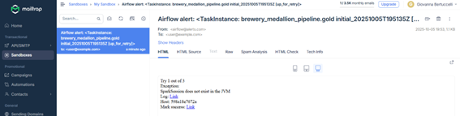
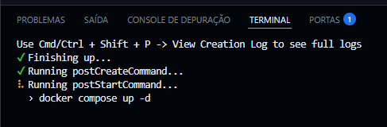
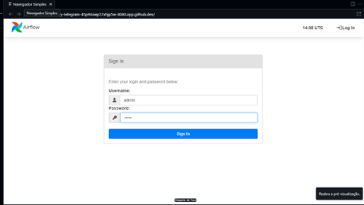
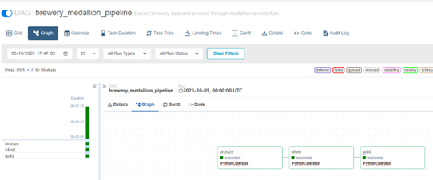
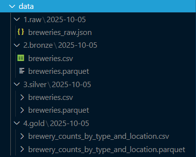
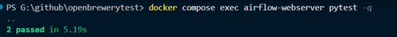

   # Open Brewery Medallion Pipeline
   
   > Built with Apache Airflow and PySpark to orchestrate, transform and deliver analytics-ready data layers.
   
   ## Quick Start
   
   - [**GitHub Codespaces**](#run-it-in-github-codespaces)
   - [**Local Docker**](#run-it-locally-with-docker)
   
   ## Table of Contents
   - [Quick Start](#quick-start)
   - [Project Story](#project-story)
   - [Architecture Overview](#architecture-overview)
   - [Repository Tour](#repository-tour)
   - [Data Flow Highlights](#data-flow-highlights)
   - [Runtime Folder Layout](#runtime-folder-layout)
   - [Environment Configuration](#environment-configuration)
   - [Security & Credentials](#security--credentials)
   - [Run It in GitHub Codespaces](#run-it-in-github-codespaces)
   - [Run It Locally with Docker](#run-it-locally-with-docker)
   - [Testing the Pipeline](#testing-the-pipeline)
   - [Troubleshooting](#troubleshooting)
   - [Operational Notes](#operational-notes)
   - [Next Experiments](#next-experiments)
   
   ## Project Story
   Open Brewery Medallion Pipeline demonstrates how to ingest, clean, and aggregate public brewery data using a medallion architecture. The pipeline couples Airflow with PySpark because PySpark keeps the Silver and Gold layers efficient even when data volume spikes, provides partition-aware writes, and allows the same code to scale from a laptop to a cluster. Additionally, both the Silver and Gold layers generate CSV snapshots for data validation purposes.
   
   The three layers are:
   - **Bronze**: Raw JSON snapshots plus a deduplicated Pandas dataset for reproducible ingestion.
   - **Silver**: Curated, normalized Parquet built with PySpark because schema enforcement and column standardization call for distributed, strongly typed transformations.
   - **Gold**: Aggregated analytics with PySpark because business metrics benefit from windowing, grouping, and late-arriving data handling that the PySpark engine solves cleanly.
   
   ## Architecture Overview
   
   
   
   Core components:
   - **Airflow DAG** (`dags/brewery_medallion_pipeline.py`): Daily schedule, retry policy, alerting hooks, and SLA tracking.
   - **bronze.py** (`scripts/bronze.py`): Handles API extraction using Requests and Pandas, with retry-aware HTTP sessions, deduplication, and raw-to-Parquet persistence.
   - **silver.py** (`scripts/silver.py`): Applies data quality checks, schema normalization, and partitioning by state_province, using PySpark for scalable and clean transformations.
   - **gold.py** (`scripts/gold.py`): Aggregates brewery counts by country, state_province, city, and type using PySpark for an analytics-ready dataset.
   
   ## Repository Tour
   ```
   .
   |-- .devcontainer/             # Codespaces definition (Docker-in-Docker, auto port forwarding)
   |-- dags/
   |   |-- brewery_pipeline.py    # Airflow DAG orchestrating Bronze -> Silver -> Gold
   |-- data/                      # Created at runtime (raw, bronze, silver, gold outputs)
   |   |-- 1.raw/                 # Raw API snapshots (JSON)
   |   |-- 2.bronze/              # Bronze Parquet and CSV
   |   |-- 3.silver/              # Silver Parquet partitioned by state
   |   |-- 4.gold/                # Gold aggregated outputs
   |-- docs/                      # Architecture notes and placeholders for diagrams
   |-- logs/                      # Airflow logs (Docker volume airflow-logs)
   |-- scripts/
   |   |-- bronze.py              # Bronze ingestion (Requests + Pandas)
   |   |-- silver.py              # Silver cleanup with PySpark because quality needs scale
   |   |-- gold.py                # Gold aggregations with PySpark analytics
   |-- tests/
   |   |-- test_bronze.py         # Unit tests for pagination and error handling
   |-- Dockerfile                 # Airflow image extended with OpenJDK for PySpark
   |-- docker-compose.yml         # Airflow + Postgres stack
   |-- requirements.txt           # Python dependencies baked into the image
   ```
   
   ## Data Flow Highlights
   1. **Bronze - Extract & Land**
      - Hits `https://api.openbrewerydb.org/v1/breweries` page by page.
      - Saves the untouched JSON snapshot to `data/1.raw/`.
      - Writes a deduplicated Parquet to `data/2.bronze/`, adding ingested_at timestamps so replays remain traceable. 
   
   2. **Silver - Curate with PySpark**
      - Uses PySpark to refine Bronze data through trimming, uppercasing, and numeric validation steps.
      - Enforces data quality by filling missing fields, tagging records with `processed_at`, and saving partitioned Parquet files by state.
   3. **Gold - Aggregate with PySpark**
      - Summaries per country/state/city/brewery_type, counting distinct breweries.
      - Persists both Parquet and single-file CSV so analysts can grab the latest snapshot.
   
   Airflow wires the stages together with daily scheduling, email alerts powered by Mailtrap credentials, and SLA markers on each task.  
   
   > 🕒 **Scheduling Note**  
   > Each DAG run processes the *previous day's* data (`execution_date = D-1`).  
   > For example, a run triggered at **2025-10-06 03:00 UTC** generates outputs labeled **2025-10-05**.  
   > This is intentional — Airflow schedules each run *after* its data window has closed, ensuring full-day completeness and consistent daily partitions.

   ## Runtime Folder Layout
   After a successful DAG run the workspace contains the following artefacts (example for execution date `2024-01-15`):
   ```
   ./data
   |-- 1.raw/
   |   |-- 2024-01-15/
   |       |-- breweries_raw.json
   |-- 2.bronze/
   |   |-- 2024-01-15/
   |       |-- breweries.csv
   |       |-- breweries.parquet
   |-- 3.silver/
   |   |-- 2024-01-15/
   |       |-- breweries.csv/
   |       |   |-- part-00000-...csv
   |       |-- breweries.parquet/
   |           |-- _SUCCESS
   |           |-- part-00000-...snappy.parquet
   |           |-- state_province=CA/
   |               |-- part-00000-...snappy.parquet
   |-- 4.gold/
       |-- 2024-01-15/
           |-- brewery_counts_by_type_and_location.csv/
           |   |-- part-00000-...csv
           |-- brewery_counts_by_type_and_location.parquet/
               |-- _SUCCESS
               |-- part-00000-...snappy.parquet
   ```
   Airflow logs live in the Docker volume `airflow-logs`; inspect them via `docker compose logs <service>` or by exec-ing into the running container.
   
   ## Monitoring & Alerts
   
   Airflow tasks are monitored through built-in SLA markers and email alerts.  
   When a task fails or retries, an email notification is sent using the Mailtrap sandbox SMTP credentials defined in `.env`.
   
   The screenshot below shows a real example of an automated failure alert delivered by Mailtrap:
   
   
  
   
   ## Run It in GitHub Codespaces
   Codespaces is the quickest way to review the project; the `.devcontainer` already ships Docker and Python tooling.
   1. **Create a Codespace** from the repository on main branch. 
   (Click the button below — **do not change any settings**, just click **“Create”** when the page opens)

      [](https://codespaces.new/gibertu/openbrewerytest)

   3. Wait for the container build to finish (~10 minutes on the first run while the Airflow image is assembled).
      
      
   4. VS Code forwards port `8080` and opens the preview because `onAutoForward` is set to `openPreview`.
   5. Sign in to Airflow using the default admin credentials (`admin` / `admin`) to monitor the `brewery_medallion_pipeline`. The initialization process automatically unpauses the DAG and launches its first execution.

      
   6. Open the **Graph** tab to capture the `bronze`, `silver`, and `gold` tasks running.

      
   7. Inspect `/workspaces/openbrewerytest/data/...` in the Explorer to show the generated Medallion outputs.

      
   
   ## Run It Locally with Docker
   
   
   Prefer to stay on your workstation? The compose file mirrors the Codespaces stack.
   1. **Clone this repository**  
      ```bash
      git clone https://github.com/gibertu/openbrewerytest.git
      cd openbrewerytest
      ```
   2. **Prerequisites**: Docker Desktop (or Docker Engine + Compose Plugin) and at least 8 GB RAM.
   3. **Build the Airflow image** (first run only, PySpark and OpenJDK layers take a few minutes):
      ```bash
      docker compose build
      ```
   4. **Initialize Airflow metadata**:
      ```bash
      docker compose up airflow-init
      ```
   5. **Start the services**:
      ```bash
      docker compose up -d postgres airflow-webserver airflow-scheduler
      ```
   6. If the port 8080 is not automatically forwarded, manually add a port forwarding rule for 8080 → 8080 in your environment settings.
   or run the container with the port explicitly mapped using:
   6. Sign in to Airflow using the default admin credentials (`admin` / `admin`) to monitor the `brewery_medallion_pipeline`. The initialization process automatically unpauses the DAG and launches its first execution.
   7. Wait for the initial run to finish or trigger additional runs on demand.
   8. Browse the generated outputs in the mounted `./data` directory.
   
   To stop everything:
   ```bash
   docker compose down
   ```
   Add `-v` if you want to remove the Postgres volume.
   
   ## Testing the Pipeline
   Automated tests live under `tests/` and currently cover the Bronze extraction logic.  
   They validate two core behaviors:
   - API pagination stops cleanly once the endpoint returns an empty page.  
   - HTTP errors propagate as expected so Airflow can handle retries.  
   
   To run the suite inside the Airflow webserver container so dependencies match the DAG runtime:
         ```bash
      docker compose exec airflow-webserver pytest -q
      ```
  Expect the output to report `2 passed`. 
  
  
   
   ## Next Experiments
   1. **Upgrade the Gold layer to Delta Lake or Apache Iceberg**  
      Replace the current Parquet-based Gold layer with Delta Lake or Iceberg tables while keeping PySpark as the processing engine.  
      ACID transactions, time travel, and schema evolution would unlock richer analytical scenarios and simplify incremental updates.
   
   2. **Enrich brewery data with external APIs**  
      Integrate additional open data sources to enhance the brewery dataset — for example:  
      - **Population or tourism datasets** to model brewery density vs. local demand.  
